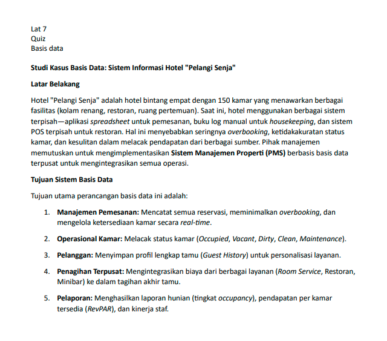

# Tugas Praktikum 6 (Pertemuan ke 7) 

|Nama|NIM|Kelas|Mata Kuliah|
|----|---|-----|------|
|**Radityatama Nugraha**|**312310644**|**TI.23.A3**|**Manajemen Basis Data**|

# Soal 1:

## - Tabel: Tamu
|Nama Atribut|Tipe Data|Keterangan|
|----|---|-----|
|**id_tamu**|**INT (PK)**|**ID unik tamu**|
|**nama_tamu**|**VARCHAR(100)**|**Nama lengkap tamu**|
|**no_telepon**|**VARCHAR(20)**|**Nomor kontak**|
|**email**|**VARCHAR(100)**|**Email tamu**|
|**alamat**|**TEXT**|**Alamat lengkap**|
|**tanggal_daftar**|**DATE**|**Tanggal pertama kali menginap**|

## - Tabel: Kamar
|Nama Atribut|Tipe Data|Keterangan|
|----|---|-----|
|**id_kamar**|**INT (PK)**|**ID unik kamar**|
|**nomor_kamar**|**VARCHAR(100)**|**Nomor kamar**|
|**tipe_kamar**|**VARCHAR(50)**|**Tipe (Standard, Deluxe, Suite, dsb)**|
|**status**|**ENUM('Occupied','Vacant','Dirty','Clean','Maintenance')**|**Status kamar**|
|**harga_per_malam**|**DECIMAL(10,2)**|**Tarif per malam**|

## - Tabel: Reservasi
|Nama Atribut|Tipe Data|Keterangan|
|----|---|-----|
|**id_reservasi**|**INT (PK)**|**ID unik reservasi**|
|**id_tamu**|**INT (FK)**|**Relasi ke tamu**|
|**tanggal_checkin**|**DATE**|**Tanggal masuk**|
|**tanggal_checkout**|**DATE**|**Tanggal keluar**|
|**status_reservasi**|**ENUM('Booked','CheckedIn','CheckedOut','Cancelled')**|**Status reservasi**|
|**total_biaya**|**DECIMAL(10,2)**|**Total biaya keseluruhan**|

## - Tabel: Detail_Reservasi
|Nama Atribut|Tipe Data|Keterangan|
|----|---|-----|
|**id_detail**|**INT (PK)**|**ID unik detail**|
|**id_reservasi**|**INT (FK)**|**Relasi ke reservasi**|
|**id_kamar**|**INT (FK)**|**Relasi ke kamar**|
|**harga_malam**|**DECIMAL(10,2)**|**Harga per malam saat dipesan**|
|**jumlah_malam**|**INT**|**Jumlah malam menginap**|

## - Tabel: Layanan
|Nama Atribut|Tipe Data|Keterangan|
|----|---|-----|
|**id_layanan**|**INT (PK)**|**ID unik layanan**|
|**nama_layanan**|**VARCHAR(100)**|**Nama layanan (Restoran, Laundry, Room Service, Minibar, dsb)**|
|**harga**|**DECIMAL(10,2)**|**Biaya layanan per unit**|

## - Tabel: Transaksi_Layanan
|Nama Atribut|Tipe Data|Keterangan|
|----|---|-----|
|**id_transaksi**|**INT (PK)**|**ID unik transaksi layanan**|
|**id_reservasi**|**INT (FK)**|**Relasi ke reservasi**|
|**id_layanan**|**INT (FK)**|**Relasi ke layanan**|
|**tanggal_transaksi**|**DATE**|**Tanggal penggunaan layanan**|
|**jumlah**|**INT**|**Jumlah unit layanan**|
|**subtotal**|**DECIMAL(10,2)**|**Total harga layanan**|

## - Tabel: Pegawai
|Nama Atribut|Tipe Data|Keterangan|
|----|---|-----|
|**id_pegawai**|**INT (PK)**|**ID unik pegawai**|
|**nama_pegawai**|**VARCHAR(100)**|**Nama pegawai**|
|**jabatan**|**VARCHAR(50)**|**Posisi kerja**|
|**shift**|**VARCHAR(20)**|**Shift kerja**|
|**kontak**|**VARCHAR(20)**|**Nomor kontak**|

